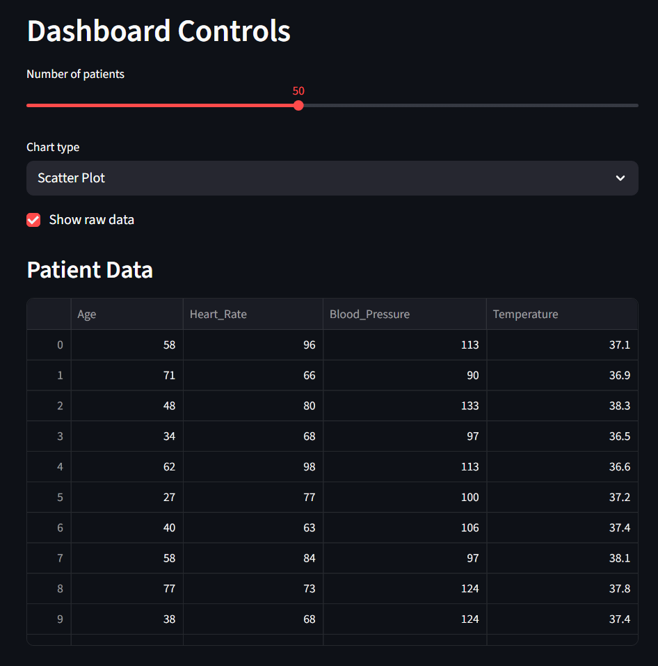
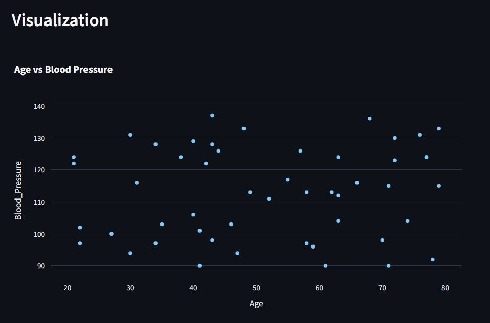

# PROHI Dashboard

**Author**: Khachatur Dallakyan  
**Collaborator**: Songyue Xie  
**Course**: Project Management and Tools for Health Informatics — HT2025  
**Lab**: Lab 2


## Overview

This interactive web dashboard was created as part of Lab 2 for the "Project Management and Tools for Health Informatics" course (HT2025) to demonstrate data visualization and dashboard development skills using Streamlit. The dashboard provides an interactive interface for exploring synthetic health data with multiple visualization options and user controls.

## Features

### 🏠 Dashboard Page
- **Interactive Controls**: 
  - Slider to adjust the number of patients (10-100)
  - Dropdown to select chart type (Scatter Plot, Bar Chart, Line Chart)
  - Checkbox to toggle raw data display
- **Synthetic Health Data**: Generates realistic patient data including:
  - Age (20-80 years)
  - Heart Rate (60-100 BPM)
  - Blood Pressure (90-140 mmHg)
  - Temperature (Celsius, around 37°C)
- **Dynamic Visualizations**: 
  - Age vs Blood Pressure scatter plot (default)
  - Heart Rate by Patient bar chart
  - Blood Pressure vs Age line chart

### 👤 About Page
- Summary of previous DSHI course assignment (Titanic survival prediction project)
- Reference to complete Jupyter notebook analysis from DSHI course

### Installation of libraries

### Dashboard Controls and Data Table

*Interactive controls allow users to adjust sample size, chart type, and toggle data visibility. The patient data table shows synthetic health records with realistic medical values.*

### Data Visualization

*The default scatter plot shows the relationship between patient age and blood pressure, with interactive features powered by Plotly.*

## Installation & Setup

### Prerequisites
- Python 3.8+ 
- pip package manager
- Virtual environment (recommended)

### Step-by-Step Installation

1. **Clone or download the project**
   ```bash
   git clone [repository-url]
   cd PROHI-lab1
   ```

2. **Create virtual environment**
   ```bash
   python -m venv env
   ```

3. **Activate virtual environment**
   - **Linux/Mac**: `source env/bin/activate`
   - **Windows CMD**: `.\env\Scripts\activate.bat`
   - **Windows PowerShell**: `.\env\Scripts\Activate.ps1`

4. **Install dependencies**
   ```bash
   pip install -r requirements.txt
   ```

5. **Verify installation**
   ```bash
   streamlit hello
   ```

## Running the Dashboard

To start the dashboard, ensure your virtual environment is activated and run:

```bash
streamlit run Dashboard.py
```

Alternative command if the above fails:
```bash
python -m streamlit run Dashboard.py
```

The dashboard will open in your default web browser at `http://localhost:8501`

## Project Structure

```
PROHI-lab1/
├── Dashboard.py              # Main dashboard application
├── pages/
│   └── About.py             # About page with project info
├── assets/
│   └── project-logo.jpg     # Project logo
├── jupyter-notebooks/
│   └── DSHI_HW3_KHACHATUR_DALLAKYAN.ipynb  # Complete analysis
├── requirements.txt         # Python dependencies
├── README.md               # This file
├── data.png                # Dashboard screenshot
└── visualization.png       # Visualization screenshot
```

# Dependencies
Tested on Python 3.12.7 with the following key packages:
- streamlit==1.46.1
- pandas==2.1.0
- numpy==1.24.0
- plotly==5.17.0
- plotly-express==0.4.1
- matplotlib==3.7.0
- seaborn==0.13.2
- jupyter==1.1.1
- scikit-learn==1.7.0
- shap==0.48.0


## License
This project is part of academic coursework and is intended for educational use.
